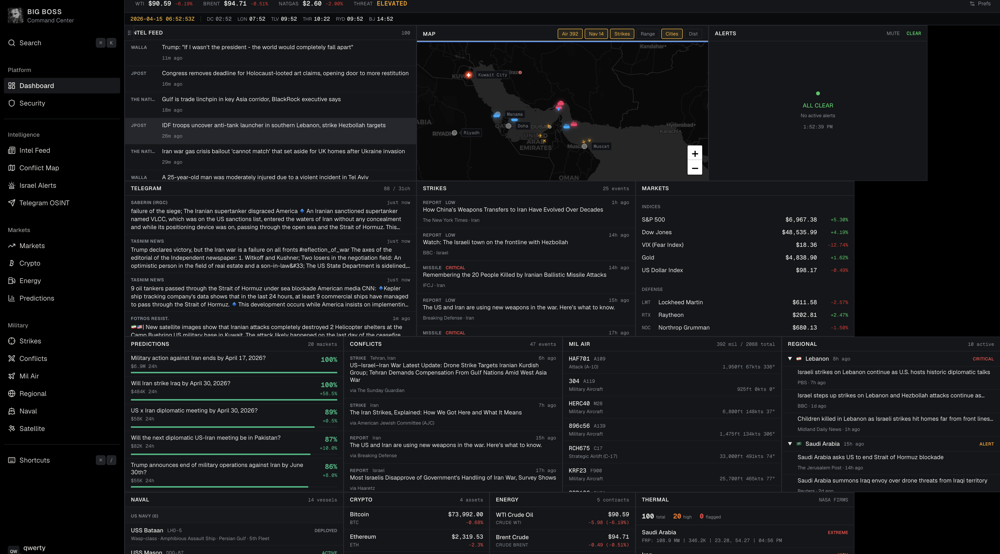

# BIG BOSS BOT



Real-time OSINT command center for monitoring the Middle East conflict. Aggregates open-source intelligence from 50+ sources across news, Telegram, military tracking, financial markets, and more into a single dashboard.

Built with Next.js, TypeScript, Tailwind CSS, Leaflet, Prisma, and Postgres. No API keys required for the upstream intel feeds.

## Multiuser Access

This project now runs as a protected multiuser application:

- Username + password authentication
- Authenticator app TOTP setup, optional by default and enforceable globally
- Recovery codes for account recovery
- Admin/member roles
- Per-user dashboard preferences
- Per-user agent access tokens for MCP clients
- Admin tools for user management, password reset, 2FA reset, and session revocation

## Features

- **Live Intel Feed** — 20+ RSS news sources with keyword relevance filtering
- **Telegram OSINT** — 27 channels scraped in real-time with auto-translation (Hebrew/Arabic/Farsi), including GCC sources
- **Theater Map** — Interactive Leaflet map with military aircraft, naval vessels, strike markers from news and Telegram, missile trajectory arcs, range rings, and distance measurement
- **Israel Alert Status** — Live Pikud HaOref / Tzeva Adom missile alerts with audio notifications and looping missile trajectory arcs on the map
- **Conflict Monitor** — Categorized events (strikes, defense, diplomatic, nuclear)
- **Missile / Strike Tracker** — Weapon type classification and severity
- **Regional Threat Monitor** — Per-country threat levels across 10 nations
- **Military Airspace** — Live military aircraft tracking via adsb.lol
- **Naval Tracker** — Vessel monitoring in the Persian Gulf and Eastern Mediterranean
- **Defense & Markets** — Defense contractor stocks, indices, VIX, gold, USD via Yahoo Finance
- **Crypto Markets** — Bitcoin, Ethereum, Solana, BNB with 24h price changes
- **Prediction Markets** — Live Polymarket odds on Middle East conflict outcomes
- **Energy Markets** — WTI, Brent, natural gas, heating oil, gasoline via Yahoo Finance
- **Satellite Thermal Detect** — NASA FIRMS fire/explosion detection

## Data Sources

All data sources are free and require no API keys.

### News RSS Feeds

| Source | Region | Feed |
|--------|--------|------|
| BBC Middle East | International | `feeds.bbci.co.uk` |
| New York Times ME | US | `rss.nytimes.com` |
| Al Jazeera | Qatar/GCC | `aljazeera.com` |
| Reuters World | International | `feeds.reuters.com` |
| CNN Middle East | US | `rss.cnn.com` |
| Fox News World | US | `moxie.foxnews.com` |
| Wall Street Journal | US | `feeds.content.dowjones.io` |
| Times of Israel | Israel | `timesofisrael.com` |
| Jerusalem Post | Israel | `jpost.com` |
| Ynet News | Israel | `ynetnews.com` |
| N12 (Mako) | Israel | `rcs.mako.co.il` |
| Walla News | Israel | `rss.walla.co.il` |
| Haaretz | Israel | `haaretz.com` |
| PressTV | Iran | `presstv.ir` |
| The National | UAE/GCC | `thenationalnews.com` |
| Drop Site News | Independent | `dropsitenews.com` |
| Google News | Aggregator | `news.google.com` (3 conflict-specific searches) |
| Breaking Defense | US Defense | `breakingdefense.com` |
| Long War Journal | US Defense | `longwarjournal.org` |
| Military Times | US Defense | `militarytimes.com` |
| War on the Rocks | US Defense/Analysis | `warontherocks.com` |
| CENTCOM | US Military | `centcom.mil` |
| DoD | US Military | `defense.gov` |

### Telegram Channels

| Channel | Perspective |
|---------|------------|
| @IDFofficial | IDF Official |
| @RocketAlert | Israeli Rocket Alerts |
| @Alertisrael | Alert Israel |
| @TimesofIsrael | Times of Israel |
| @AbuAliExpress | Abu Ali Express (Israeli OSINT) |
| @OSINTdefender | OSINT Defender |
| @warfareanalysis | Warfare Analysis |
| @rnintel | RN Intel |
| @GeoPWatch | GeoPol Watch |
| @middle_east_spectator | ME Spectator |
| @Middle_East_Spectator | ME Spectator 2 |
| @HAMASW | Hamas-Israel War Updates |
| @PressTV | PressTV (Iran) |
| @iranintl_en | Iran International |
| @FarsNews_EN | Fars News (Iran) |
| @TasnimNewsEN | Tasnim News (Iran) |
| @SaberinFa | Saberin (IRGC-affiliated) |
| @defapress_ir | DefaPress (Iran MOD) |
| @sepah | IRGC Official |
| @FotrosResistancee | Fotros Resistance |
| @QudsNen | Quds News |
| @Alsaa_plus_EN | Al-Saa EN |
| @thecradlemedia | The Cradle |
| @dropsitenews | Drop Site News |
| @france24_en | France 24 |
| @wamnews_en | WAM - Emirates News Agency (UAE) |
| @gulfnewsUAE | Gulf News (UAE/GCC) |

### APIs

| Service | Data | Provider | Cost |
|---------|------|----------|------|
| Yahoo Finance | Stock prices, indices, commodities, oil futures | Yahoo | Free, no key |
| Tzeva Adom | Israeli missile/rocket alerts | Community mirror of Pikud HaOref | Free, no key |
| NASA FIRMS | Fire/thermal detection satellite data | NASA | Free, no key |
| adsb.lol | Military aircraft ADS-B tracking | Community ADS-B network | Free, no key |
| GDELT | Global event data | GDELT Project | Free, no key |
| CoinGecko | Cryptocurrency prices (BTC, ETH, SOL, BNB) | CoinGecko | Free, no key |
| Polymarket | Prediction market odds (Middle East conflict) | Polymarket | Free, no key |
| Google Translate | Hebrew/Arabic/Farsi auto-translation | Google (unofficial) | Free, no key |

### Polling Intervals

| Feed | Interval |
|------|----------|
| Israeli Alerts (Pikud HaOref) | 5 seconds |
| Telegram Channels | 60 seconds |
| News RSS | 90 seconds |
| Strikes | 2 minutes |
| Conflicts | 3 minutes |
| Markets, Oil, Crypto & Polymarket | 5 minutes |
| Fires (NASA FIRMS) | 10 minutes |

## Getting Started

```bash
cp .env.example .env
openssl rand -hex 32
```

Paste the generated value into `AUTH_ENCRYPTION_KEY` in `.env`, then set `BOOTSTRAP_ADMIN_USERNAME` and `BOOTSTRAP_ADMIN_PASSWORD`.

```bash
npm run db:up
npm install
npm run db:migrate
npm run bootstrap:admin
npm run dev
```

The bundled Docker Postgres instance listens on `127.0.0.1:${POSTGRES_PORT:-54329}`.

Open [http://localhost:3000](http://localhost:3000).

## Docker Compose

You can run the full stack in Docker:

```bash
cp .env.example .env
openssl rand -hex 32
```

Paste the generated value into `AUTH_ENCRYPTION_KEY` in `.env`, then set `BOOTSTRAP_ADMIN_USERNAME` and `BOOTSTRAP_ADMIN_PASSWORD`.

```bash
docker compose up --build
```

If `54329` or `3000` is already in use on your machine, set `POSTGRES_PORT` and/or `APP_PORT` in `.env` before starting the stack.

The container now refuses to start if `AUTH_ENCRYPTION_KEY` or `BOOTSTRAP_ADMIN_PASSWORD` still use the example placeholder values.

That starts:

- `postgres` on `127.0.0.1:${POSTGRES_PORT:-54329}` by default
- `app` on [http://localhost:3000](http://localhost:3000) by default

If you also want the bundled MCP sidecar in Docker, use `docker compose --profile mcp up --build` and pass `BIG_BOSS_API_TOKEN` in `.env`.

The app container automatically:

- waits for Postgres to become healthy
- applies Prisma migrations
- bootstraps the first admin when `BOOTSTRAP_ADMIN_USERNAME` and `BOOTSTRAP_ADMIN_PASSWORD` are set

Useful scripts:

- `npm run docker:up` starts the full stack in the background
- `npm run docker:down` stops the full stack
- `npm run docker:logs` tails the app and database logs
- `npm run db:up` still starts only Postgres for local non-Docker app development

## GHCR Image

GitHub publishes the app image to `ghcr.io/kitakitsune0x/bigbossbot`.

- `main` updates the `latest` and `main` tags
- each published build also gets a `YYYY.MM.DD` tag based on the build date
- tagged releases publish matching version tags
- if you want anonymous `docker pull` from a public VM, make the GHCR package public after the first publish
- Docker Compose uses `BIG_BOSS_IMAGE` and defaults to the GHCR image name above

## Build Versions

- `npm run build` stamps each build with a date version in `YYYY.MM.DD` format
- the build version is persisted in `.build-version` so the MCP server can report the same version after the build finishes
- set `APP_VERSION` before `npm run build` or `docker compose build` if you need to override the auto-generated date for a deterministic rebuild

## Self-Hosting

For a public repository, treat the top-level [docker-compose.yml](./docker-compose.yml) file as local development and single-machine testing.

For an internet-exposed VM, use [docs/vps-deploy.md](./docs/vps-deploy.md) together with [docker-compose.vps.yml](./docker-compose.vps.yml). That path is designed for a public repo, Docker-based self-hosting, GHCR image updates, Caddy-managed HTTPS, and private runtime secrets that stay only on the server.

1. Clone the repo on your server and move into the project directory.

```bash
git clone https://github.com/kitakitsune0x/bigbossbot.git
cd bigbossbot
```

2. Copy the production env template and edit it on the server only.

```bash
cp .env.production.example .env.production
```

3. Replace every placeholder value in `.env.production`. At minimum, set:

- `APP_DOMAIN` to the DNS hostname pointing at your VM
- `BIG_BOSS_IMAGE=ghcr.io/kitakitsune0x/bigbossbot:YYYY.MM.DD` to pin an exact build, or leave `:latest` if you want the moving default
- `AUTH_ENCRYPTION_KEY` to a long random secret
- `AUTH_REQUIRE_2FA=false` if you want authenticator setup to stay optional on signup, or `true` if you want to enforce it globally
- `BOOTSTRAP_ADMIN_USERNAME` and `BOOTSTRAP_ADMIN_PASSWORD` to the first admin account you want created
- `POSTGRES_PASSWORD` and `DATABASE_URL` for the bundled Postgres service

4. Pull the published containers and start the production stack.

```bash
docker compose --env-file .env.production -f docker-compose.vps.yml up -d
```

5. Point your DNS `A` or `AAAA` record at the VM, open ports `80` and `443`, and let Caddy obtain the certificate automatically.

6. Follow the full VM deployment guide in [docs/vps-deploy.md](./docs/vps-deploy.md) for automatic updates, rollbacks, and Caddy setup details.

Recommended production setup:

- keep the bundled Postgres volume mounted so data survives container restarts
- update by changing `BIG_BOSS_IMAGE` to a newer `YYYY.MM.DD` tag, then run `docker compose --env-file .env.production -f docker-compose.vps.yml up -d`
- enable Watchtower later with `docker compose --profile watchtower --env-file .env.production -f docker-compose.vps.yml up -d watchtower` once your Docker tooling is up to date
- if you rebuild locally and want a pinned date tag inside the image metadata, export `APP_VERSION=YYYY.MM.DD` before `docker compose build`

## Auth Setup Notes

- `npm run db:up` starts the Docker Postgres service defined in [docker-compose.yml](./docker-compose.yml)
- `npm run db:migrate` applies the checked-in Prisma migration to the running database
- `npm run bootstrap:admin` creates the first admin using `BOOTSTRAP_ADMIN_USERNAME` and `BOOTSTRAP_ADMIN_PASSWORD`
- `AUTH_REQUIRE_2FA=true` forces every account through authenticator setup before `/dashboard`; the shipped default is optional 2FA
- `AUTH_ENCRYPTION_KEY` should be a long random secret anywhere outside disposable local development

## MCP Access

BIG BOSS BOT includes a local stdio MCP server for agents that need live read-only intel.

- Create a read-only token in `Account -> Settings -> Agent access tokens`
- Start the web app with `npm run dev`
- Start the MCP sidecar with `npm run mcp`
- Configure your client with `BIG_BOSS_BASE_URL` and `BIG_BOSS_API_TOKEN`
- Docker users can run the same sidecar with `docker compose --profile mcp run --rm mcp`

Full setup instructions, client config snippets, and the bundled Codex skill are in [docs/mcp.md](./docs/mcp.md).

## Tech Stack

- **Framework:** Next.js 16 (App Router)
- **Language:** TypeScript
- **Styling:** Tailwind CSS
- **Maps:** Leaflet / React-Leaflet
- **XML Parsing:** @xmldom/xmldom

## Legal Disclaimer

### Purpose and Scope

This project is provided strictly for **educational and research purposes**. It demonstrates techniques for aggregating publicly available open-source intelligence (OSINT) using modern web technologies. It is not intended for commercial use, resale of data, or any activity that violates applicable laws or third-party terms of service.

### Data Sources

All data is sourced from publicly accessible endpoints. No paywalls are bypassed, no authentication is circumvented, and no copyrighted content is reproduced in full -- only headlines, links, and publicly available metadata are displayed.

### Unofficial Endpoints

Some data sources rely on **unofficial or undocumented public endpoints**, including but not limited to: Yahoo Finance chart data, Google Translate, Telegram channel embeds, and Google News RSS feeds. These endpoints:

- Are not officially supported APIs and may violate the respective provider's Terms of Service
- May stop working, change, or be blocked without notice
- Are used here solely for non-commercial educational demonstration
- Should be replaced with official APIs if you intend to use this project commercially or in production

### Third-Party Content

News content, Telegram posts, financial data, alert data, and all other third-party content belong to their respective publishers, organizations, and data providers. This project does not claim ownership of any third-party content. Market data may be subject to additional redistribution restrictions from upstream data licensors.

### User Responsibility

By using this software, you agree that:

- **You are solely responsible** for ensuring your use complies with all applicable laws and third-party terms of service in your jurisdiction
- The authors and contributors of this project are **not liable** for any misuse, TOS violations, legal claims, or damages arising from use of this software
- You will **not use this software** for commercial data redistribution, automated trading, or any purpose that violates the terms of the underlying data providers
- This software is provided **"as is"** without warranty of any kind

### ADS-B Data Attribution

Military aircraft tracking data is provided by [adsb.lol](https://www.adsb.lol) under the [Open Database License (ODbL 1.0)](https://opendatacommons.org/licenses/odbl/1-0/).

### No Endorsement

This project is not affiliated with, endorsed by, or sponsored by any of the data providers, news organizations, governments, or military entities whose data it aggregates.

## License

[MIT](LICENSE)
